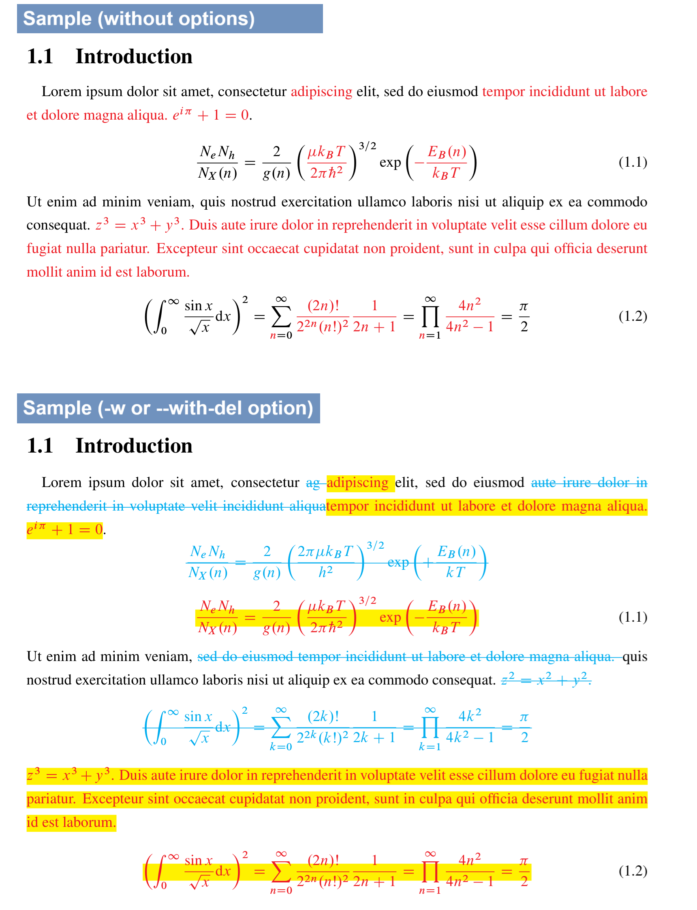

# latexdiff-wrapper

- The scripts in this project enable you to quickly generate a PDF of the difference between two tex files.
- These scripts automatically execute `latexdiff-vc` and `latexmk` to obtain and compile the difference file.
- The same arguments as those in `latexdiff-vc` can be used; you can generate a PDF for the difference from files managed in `git` using the `-r` option, for example.




## Installation

This project includes the following two scripts:

```
ck-latexdiff.sh  ck-latexdiff-wrapper.sh
```

Place these script in the directory registered in the `$PATH` (`$HOME/local/bin`, `/usr/local/bin`, etc.).

e.g.

```
$ ls *.sh
ck-latexdiff-wrapper.sh  ck-latexdiff.sh
$ mv *.sh $HOME/local/bin
```


## Prerequisites

- Linux system
- `latexdiff-vc`
- `latexmk`; you should create `.latexmkrc` file
- Language: I checked English and Japanese documents


## Usage

### ck-latexdiff-wrapper.sh [recommended]

Using this script instead of `ck-latexdiff.sh` is recommended unless there is a special reason. This script is the wrapper of `ck-latexdiff.sh` to run it easily.

The usage is the same as `latexdiff-vc` and the same arguments can be used. For instance, to generate a PDF by differencing `before.tex` and `after.tex`, run the following command:

```
$ ck-latexdiff-wrapper.sh before.tex after.tex
```

This generates the PDF file of `./diff/<second tex filename>_diff_<date text>.pdf`.


#### Options

```
Usage:
ck-latexdiff-wrapper.sh [ --suffix=* ] [ -w or --with-del ]
        [ --not-rm-diffsrc ]
        [ latexdiff-options ] [ latexdiff-vc-options ]
        -r [rev1] [-r rev2] file1.tex [ file2.tex ]

--suffix=*        Filename suffix [default: "_diff<wd>_<date text>"]
-w or --with-del  Flag to show text before modified.
--not-rm-diffsrc  Flag not to remove diff src files.
-h  or  --help    Show this help text.
```

- `--suffix=*`
  Use to specify the file name suffix for the generated PDF. File name: `./diff/<tex filename><suffix>.pdf`
- `-w` or `--with-del`
  Use If you want to highlight the parts before the changes as well as those after the changes. The filename of the generated PDF is `./diff/<second tex filename>_diffwd_<date text>.pdf` when `--suffix` option is not used.
- `--not-rm-diffsrc`
  By default, non-PDF productions such as diff `.tex` files are removed. You can avoid this by using this option.


#### Configuration files

`ck-latexdiff-wrapper.sh` automatically generates the configuration file  for `latexdiff-vc --preamble <config file>` if those do not exist.

```
$ ls ~/.config/latex/
diffpreamble-withdel.tex  diffpreamble.tex
```

The respective `diffpreamble.tex` and `diffpreamble-withdel.tex` are made by `ck-latexdiff-wrapper.sh` without and with `-w` option.

Edit these configuration files if you want to change the highlight markup in the PDF.


> [!NOTE]
> Some options for `latexdiff-vc` are used when `latexdiff-vc` is run in this script.
>
> - `--flatten`
> - `--math-markup`: 1 if `-w` or `--with-del` option is used, otherwise 3. 


### ck-latexdiff.sh

The usage is the same as `latexdiff-vc` and the same arguments can be used. For instance, to generate a PDF by differencing `before.tex` and `after.tex`, run the following command:

```
$ ck-latexdiff-wrapper.sh --flatten --math-markup=1 before.tex after.tex
```

This generates `./diff/after_diff_${date}.pdf` file.


#### Options

```
Usage:
ck-latexdiff.sh [ --dir=* ] [ --diffsuffix=* ] [ --not-rm-diffsrc ]
        [ latexdiff-options ] [ latexdiff-vc-options ]
        -r [rev1] [-r rev2] file1.tex [ file2.tex ]

--dir              Out-directory [default: "diff"]
--diffsuffix       Filename suffix [default: "_diff_$date"]
--not-rm-diffsrc   Flag not to remove diff src files.
-h  or  --help     Show this help text.
```

